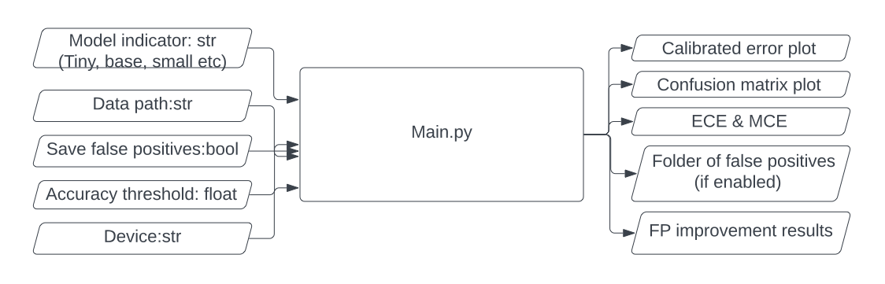
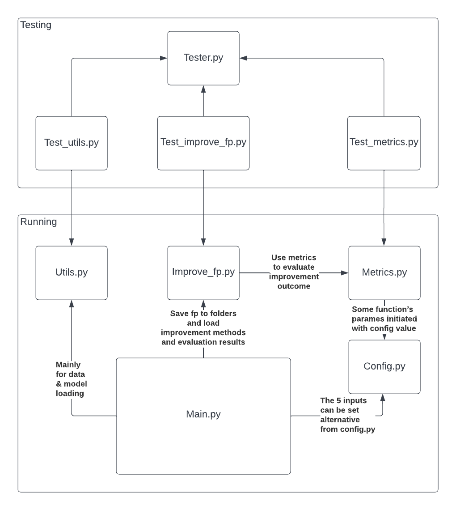

<!-- TABLE OF CONTENTS -->
## Table of Content
<ol>
  <li>
    <a href="#about-the-project">Project Overview</a>
    <ul>
      <li><a href="#io-diagram">IO Diagram</a></li>
      <li><a href="#code-structure-breakdown">Script Component Diagram</a></li>
    </ul>
    </li>
  <li>
    <a href="#about-the-project">Techniques Employed</a>
    <ul>
      <li><a href="#io-diagram">Early Stopping</a></li>
      <li><a href="#io-diagram">Testing Logic</a></li>
      <li><a href="#io-diagram">False Positive Improvement</a></li>
    </ul>
  </li>
  <li>
      <a href="#io-diagram">Future Integration</a>
  <li>
    <a href="#getting-started">Getting Started</a>
    <ul>
      <li><a href="#prerequisites">Prerequisites</a></li>
    </ul>
  </li>
  <li><a href="#usage">Usage</a></li>
  <ul>
      <li><a href="#prerequisites">Running</a></li>
      <li><a href="#prerequisites">Testing</a></li>
  </ul>
</ol>

<!-- ABOUT THE PROJECT -->
## Project Overview
This is a python script to evaluate the performance of a classification model. The script is designed to help a fellow Data Scientist asses the performance of a model and potentially debug / or assure their model’s performance. 

### Built with
Python3.10

### IO Diagram

The script *main.py* takes in 5 parameters:
* **model** - optional: tiny / small / base / large. Default to tiny.
* **data** - default to data/mnist/test.
* **save_fp** - decide if to save false positive samples into sub-folder *results/false_positives*.
* **acc_thresh** - default to 0. If > 0, the early stopping procedure will be activated.
* **device** - default to 'cuda:0'.

Script *main.py* gives the following output:
* Plots for calibrated errors and confusion matrix are saved in *results*.
* ECE and MCE values are printed on-screen.
* False positive samples are stored in *results/false_positives*.
* False positive improvement results are printed on-screen. Print nothing if *false_positives* folder does not exist or is empty.

### Script Component Diagram


The script components can be divided into two blocks - **running** and **testing**. The order of import and reasons are demonstrated in above diagram. 

**Note**: The 5 input params can be set alternatively with config.py as well as other hyper parameters.

<p align="right">(<a href="#readme-top">back to top</a>)</p>

## Techniques Employed

### Early Stopping
Set parameter acc_thresh to value above **0** to enable this behavior.

```diff
- UserWarning: Model accuracy below set threshold. Terminating evaluation now...
```
Assume dataloader randomly shuffles, if accuracy for the first batch is lower than set threshold, the script will terminate batch iteration and return CE and save plots for this batch.

### Testing Logic
In case of any changes to the scripts or using scripts on new inputs, tests against functions are created to quickly examine the validity of function or compatibility between new input and the function to save debugging efforts. Testing scripts are saved in *testing* sub-folder.

The tests are to assert matching of set input-out pairs that are designed to handle different case scenarios (except plot tests which relies on manual check of plots). For example, 2 cases are covered for MCE, ECE tests - when some bins are of 0 count vs. all bins are of 0 count:
```python
    assert round(float(ece), 3) == 0.192, "wrong ECE for normal CE"
    assert round(float(mce), 3) == 0.390, "wrong mce for normal CE"

    assert get_mce(ce) == -0.1, "wrong MCE for all non-existent CE"
    assert get_ece(ce_b, batch_size) == -0.1, "wrong ECE for all non-existent CE"
```

For confusion matrix test, 3 scenarios are covered - when some prediction is correct / all are correct / prediction and label set is empty:
```python
    cm = get_confusion_matrix(y_pred, y_true, n_class=class_size)
    assert cm.tolist() == [[2, 2, 1],
                           [0, 2, 1],
                           [1, 0, 1]], "wrong confusion matrix computation"
    test_plot_cm(cm, "cm_normal")

    cm = get_confusion_matrix(y_pred, y_pred, n_class=class_size)
    assert cm.tolist() == [[3, 0, 0],
                           [0, 4, 0],
                           [0, 0, 3]], "wrong confusion matrix computation"
    test_plot_cm(cm, "cm_all_correct")

    cm = get_confusion_matrix(torch.tensor([]), torch.tensor([]), n_class=class_size)
    assert cm.tolist() == torch.zeros(class_size, class_size).int().tolist(), \
        "wrong confusion matrix computation"
    test_plot_cm(cm, "cm_empty")
```

**Note**: Need to pass all tests before branch merge.


### False Positives Improvement
The idea is to reduce data dimensionality and perform clustering on the lower D dataset.

This script uses **T-sne** for d-reduction and **K-means** for clustering.

<p align="right">(<a href="#readme-top">back to top</a>)</p>


## Future Integration
* ### More metrics

  For better evaluation and debugging potential, including more metrics and visualization of metrics will definitely improve usability. For example, for classification task, precision, recall, accuracy, ROC and AUC can be included and visualized.


* ### Database Integration

  Currently, the evaluation outcomes are saved locally, rerun of the script unless change save path will write over past records. Integration with database, submitting session-id and metric value via database API will allow past session lookup, and for visual comparison with tools like tensorboard.


<p align="right">(<a href="#readme-top">back to top</a>)</p>


<!-- GETTING STARTED -->
## Getting Started

### Prerequisites

Install the required packages with pip to get started.
* pip
  ```sh
  pip install -r requirements.txt
  ```


<p align="right">(<a href="#readme-top">back to top</a>)</p>


<!-- USAGE -->
## Usage

### Running
Can simply run with parameters readily defined in **config.py**:
```commandline
python3 main.py
```
Otherwise, please define them with commandline:
```commandline
python3 main.py -d dataset/mnist/test -m base -t 0.2 -s true --device cpu
```

### Testing
To run individual script:
```commandline
python3 test_metrics.py
```
To run all:
```commandline
sh run.sh
```
The testing plots and false positives are saved in *testing/vis* and *testing/results/false_positives*
<p align="right">(<a href="#readme-top">back to top</a>)</p>